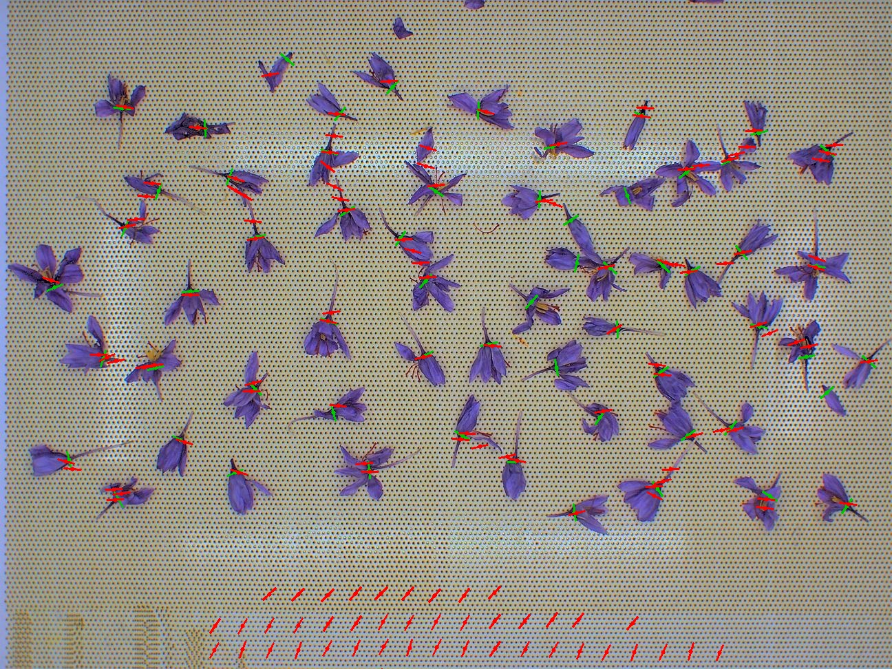
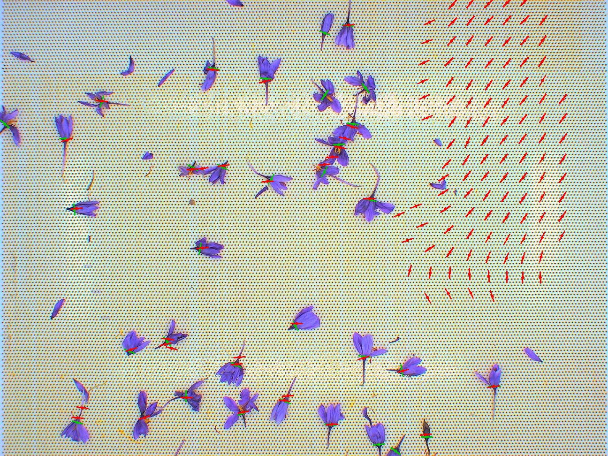

# Detecting the Center and Cutting Angle of Saffron Flowers with a Center/Angle-Adapted RefineDet

**Course project, Digital Image Processing, Iran University of Science and Technology.**
Base paper: Zhang, Wen, Bian, Lei & Li, *"Single-Shot Refinement Neural Network for Object Detection"*, CVPR 2018 [1].

---

## 1. Problem statement

Standard object detectors output an axis-aligned bounding box per object. This
project's target quantity is different: for every saffron flower visible in
an image, we need its **center** `(x, y)` and its **cutting angle** `theta in
[0, 360)` degrees — no box size is ever labeled or evaluated. The project
brief is explicit about this reframing: *"object detection algorithms look
for the bounding rectangle of each object, but here we are looking for the
center and angle of objects"* [9]. Concretely:

- **Input**: a 1296x972 RGB photograph of harvested saffron flowers scattered
  on a surface (`data/Labeled`, `data/Unlabeled`, `data/Test`).
- **Output**: a variable-length list of `(x, y, angle_deg)` triples, one per
  flower, plus a confidence score for the graded `Test/` predictions.
- **Supervision**: 14 labeled images (764 flowers total, `data/Labeled/*.csv`),
  129 unlabeled images (`data/Unlabeled/`) usable for semi-/self-supervised
  learning, and 18 held-out test images (`data/Test/`) that this project
  predicts on but never gets ground truth for.

## 2. Chosen paper: RefineDet

RefineDet [1] is a single-stage detector built around two cooperating
modules and a feature-fusion bridge between them:

- **ARM (Anchor Refinement Module)**: a light head on top of each of several
  backbone feature maps that (a) does *binary* objectness classification
  (background vs. any object) per anchor and (b) regresses a first-pass
  box offset. Its role is to filter the overwhelming majority of easy
  background anchors and coarsely relocate the surviving ones — the same
  problem two-stage detectors solve with a Region Proposal Network, but
  without a separate cropping/pooling stage.
- **TCB (Transfer Connection Block)**: a top-down path that fuses each
  backbone feature map with the (upsampled) richer semantic features from
  the next coarser scale, structurally the same idea as a Feature Pyramid
  Network [5], predating FPN's popularization by a few months.
- **ODM (Object Detection Module)**: the final multi-class classification
  and second-stage box regression, applied to the TCB's fused features
  using the ARM-refined anchors as its reference boxes instead of the
  original fixed anchor grid.
- **Negative anchor filtering**: anchors ARM is already highly confident
  (>0.99) are background get dropped from the ODM loss entirely, so ODM's
  training signal is concentrated on positives and genuinely ambiguous
  negatives.

The backbone is a "fully convolutional reduced" VGG16 [2, 3]: `pool5`
widened from 2x2/stride-2 to 3x3/stride-1, and the classifier's `fc6`/`fc7`
converted into a dilated 3x3 and a 1x1 convolution respectively, both
initialized from the pretrained classifier weights by kernel *decimation*
(subsampling every k-th row/column, first introduced for this exact
purpose in SSD [2]) rather than random initialization. Two extra
stride-2 conv blocks are appended after `fc7` to reach lower-resolution,
larger-receptive-field feature maps. Four feature maps in total feed the
ARM/ODM: `conv4_3` (stride 8), `fc7` (stride 16), `conv6_2` (stride 32),
`conv7_2` (stride 64). Because `conv4_3`'s activations are much larger in
magnitude than the deeper layers, it is L2-normalized with a learnable
per-channel scale before use [2].

## 3. Why a PyTorch reimplementation instead of the bundled Caffe code

`RefineDet/` in this repository is the paper authors' original Caffe C++
release. It was kept as an architectural reference but is **not built or
run**, for three concrete reasons:

1. **Target hardware.** Development happens on Apple Silicon; the actual
   training runs happen on a separate GPU VM and/or Google Colab. A
   from-scratch PyTorch model uses the exact same code path on all three —
   `torch.cuda.is_available()` selects CUDA when present and falls back to
   Apple's MPS backend otherwise (`saffron_cut/device.py`) — whereas Caffe's
   build and its CUDA/cuDNN bindings are a second, platform-specific
   toolchain with no equivalent Apple Silicon backend at all.
2. **The output heads have to be rewritten regardless.** Every one of
   RefineDet's four detection heads regresses a 4-D box offset. This
   project regresses a 2-D center offset plus a 2-D angle vector instead
   (Section 4.2) — a structural change to the prediction heads and the
   loss, not a hyperparameter. Whatever the original Caffe VOC/COCO
   checkpoint learned for 4-D box regression is not transferable to a
   2-D center + angle head, so there is no pretrained-*detector* weight to
   lose by not using the Caffe build; only the backbone's ImageNet weights
   matter, and those are available directly from `torchvision` regardless
   of framework (Section 4.1).
3. **Toolchain risk.** Caffe's build (BLAS/protobuf/cuDNN version pinning,
   Python-2-era bindings) is unmaintained and brittle to build from source
   in 2026, with no upside here since (1) and (2) already rule out reusing
   its trained weights or its Apple-Silicon-incompatible runtime.

The architecture below is therefore a faithful PyTorch reimplementation of
RefineDet's ARM/TCB/ODM cascade and its VGG16-atrous backbone, with the
prediction heads and matching/loss adapted from box regression to
center+angle regression.

## 4. Architecture adaptation

### 4.1 Backbone

`torchvision`'s ImageNet-pretrained VGG16 [3, 4] up through `relu4_3` and
`relu5_3`, with `pool5`, `fc6`, `fc7` and the two extra conv blocks built
exactly as described in Section 2 (`src/saffron_cut/model/backbone.py`).
This *is* "reaching the pretrained base model": the backbone starts from
weights trained on 1.28M ImageNet images rather than from scratch, which
matters enormously given the target dataset here has only 11-14 labeled
images (Section 6).

### 4.2 From boxes to points: anchors, heads and matching

A box detector anchors several box *shapes* per spatial cell, because it
needs to cover a range of object sizes/aspect ratios and regress toward
one of them. A point has no shape, so there is exactly **one anchor per
cell** here — just that cell's own receptive-field center
(`model/anchors.py`). Every ARM/ODM head regresses a 2-D `(dx, dy)` center
offset instead of a 4-D box offset, and the ODM head gains a third,
2-D output for the cutting angle.

**Angle encoding.** The angle is *not* regressed as a raw degree value.
The head outputs an unnormalized 2-vector trained toward
`(cos(theta), sin(theta))` with SmoothL1 loss, and is decoded with
`atan2`. This avoids the discontinuity a raw-degree regression would hit
at the 0/360 wraparound (a flower at 359 degrees and one at 1 degree are
visually near-identical but 358 degrees apart numerically) — a standard
trick for regressing circular quantities.

**Matching (anchor <-> ground truth).** SSD/RefineDet assign anchors to
ground-truth boxes by IoU. There is no ground-truth box here, so an anchor
is a positive match for a flower when the anchor's own center falls within
one grid cell of that flower's center — the direct point-detection
analogue of IoU matching, in the spirit of the center-sampling idea later
formalized by FCOS [8]. Every flower is additionally guaranteed its single
closest anchor as a positive match (mirroring SSD's "ensure every ground
truth has >=1 prior" rule), so a flower can never be orphaned even if it
falls in a gap between anchor centers (`model/matching.py`).

**Two-stage cascade, preserved.** ODM's positive/negative assignment is
recomputed against the ARM-*refined* centers (`anchor + arm_loc`), not the
raw anchor grid — the actual mechanism that makes this a cascade rather
than two independent detectors, and it is why ARM's loc loss uses
`.detach()`-ed values when feeding ODM's matching (the refinement target
gradients flow through ARM's own loss, not through ODM's).

### 4.3 Losses

Both ARM and ODM use 2-way (background/flower) softmax cross-entropy with
hard-negative mining at a 5:1 negative:positive ratio (mining the
*highest-loss* negatives, standard SSD-style practice, though at a higher
ratio than SSD/RefineDet's usual 3:1 -- see Section 4.4 for why), plus
SmoothL1 on the center offset for positive anchors. ODM additionally
applies SmoothL1 on the `(cos, sin)` angle vector for positive anchors
(weighted 3x relative to the other losses -- again, Section 4.4), and its
cross-entropy is computed only over anchors that survive **negative anchor
filtering**: negatives ARM already scores as background with >0.99
confidence (or whose ARM-predicted shift is implausibly large) are
excluded from the ODM loss entirely (`model/loss.py`).

### 4.4 Why precision is low: a point-radius target is smaller than what the network can actually see

An anchor-matching bug was found and fixed during development, and is
worth recording alongside the *design tension* that remained after fixing
it, since both directly explain this project's headline results
(Section 9).

**The bug.** The match radius (Section 4.2) is `pos_radius_cells * stride`
*per level*. At the two coarsest levels (stride 32, 64), that is a 32px or
64px radius -- larger than the ~28px typical spacing between distinct
flowers at network-input scale (Section 5.2's letterbox scale applied to
the ~71.5px median nearest-neighbor spacing measured directly from
`Labeled/*.csv`). An anchor that large essentially always has *some*
flower within its radius, so nearly every coarse-level anchor was being
labeled a positive match for its nearest flower, regardless of whether it
was anywhere near a sensible location for it. The fix
(`cfg.pos_radius_px`, `model/matching.py`) caps the radius at a fixed 12px
regardless of level.

**What that fix did not fully solve.** Even after capping the radius,
validation-set precision stayed very low (recall was reasonable --
roughly 0.35-0.45 -- but for every true positive there were tens of false
positives). Loading a trained checkpoint and inspecting its raw ODM
objectness scores directly showed why: the classifier was scoring a large,
spatially *contiguous* fraction of each image as foreground, not a
scattering of independent false positives. Cross-referencing against the
source images (e.g. `data/Labeled/001.jpg`) makes the mechanism obvious --
each flower's visible petals and stem span roughly 100-300px, far larger
than the 12px radius around its single labeled center point. The network
has a perfectly learnable visual cue available (purple flower material vs.
the light mesh tray background) and, expectedly, partially learns *that*
cue -- "this looks like flower material" -- rather than the much harder,
almost purely geometric task the label actually asks for: "this is within
12px of the specific point a human clicked as this flower's center."
Telling those two things apart from local texture alone is a much finer
discrimination than "flower vs. tray," and the offset-regression heads
that are supposed to pull scattered nearby detections back onto the exact
center have comparatively few positive-anchor gradient updates to learn
from (Section 6). The `neg_pos_ratio=5` and `angle_loss_weight=3` values
in `config.py` are direct responses to this diagnosis: more mined hard
negatives per positive gives the classifier more of exactly the
confusing-but-important "flower material, wrong point" examples to learn
from, and up-weighting the angle loss compensates for it having far fewer
positive-anchor updates than the classification loss to learn from in the
first place. Both help, but do not eliminate the underlying tension --
see Section 9 for the actual effect size, and Section 10 for what a much
larger training budget (i.e. the GPU VM / Colab run this pipeline is built
for) would plausibly change.

## 5. Data pipeline

### 5.1 Label format

`Labeled/NNN.csv` has one row per flower: `x, y, angle_deg` (no header,
angle spans the full `[0, 360)` circle — confirmed empirically from the
provided data, not just `[0, 180)`, so flower orientation is a *direction*,
not an undirected line). `Test/NNN.csv` is written in the same layout plus
a trailing `probability` column, per the brief's spec.

### 5.2 Augmentation, and why angle correctness is the one thing that had to be gotten exactly right

Every geometric augmentation (`data/transforms.py`) — random crop, random
rotation up to +/-20 degrees, horizontal/vertical flip, and the final
isotropic letterbox resize to the network's input resolution — transforms
flower **positions as points** (apply the affine map's linear part and
translation) and flower **orientation as a unit direction vector**
`(cos theta, sin theta)` (apply the *linear part only*, no translation),
then re-derives the angle with `atan2` after each transform. This sidesteps
manually re-deriving a sign convention per augmentation (e.g. "does a
horizontal flip mean `theta -> 180 - theta` or `theta -> -theta`?"); as
long as the point and the direction vector are pushed through the *same*
linear map, the recovered angle is correct by construction, regardless of
the coordinate system's handedness.

The other detail that would otherwise silently corrupt every angle label:
the source images are 1296x972 (4:3), not square, and the network input is
square. Resizing 1296x972 -> 512x512 **anisotropically** (independent x/y
scale factors) changes the *apparent* angle of every non-axis-aligned line
segment. All resizing in this pipeline is therefore **isotropic** —
`letterbox()` scales by `min(size/w, size/h)` uniformly and pads the
remainder — which leaves angles exactly unchanged, at the cost of some
unused padding for non-square crops.

### 5.3 Train/val split

With only 14 labeled images, `cfg.val_split` (default 3) images are held
out for validation, seeded and shuffled once (`cfg.val_seed`) so the split
is reproducible; the remaining 11 train. This is a small enough validation
set that its AP estimate should be read as indicative, not precise — see
Section 9's limitations discussion.

## 6. Training setup

SGD with momentum 0.9, weight decay 5e-4, initial LR 1e-3, linear warmup,
then a 0.1x step decay at configured epoch milestones — the same recipe
family as the original RefineDet/SSD papers. The one departure from
"textbook" VOC/COCO-scale numbers: with only 11 training images at batch
size 4, an epoch is **3 iterations**, so warmup and milestones are
expressed in small epoch/iteration counts (`cfg.lr_warmup_iters`,
`cfg.lr_milestones`) rather than the hundreds-to-thousands typical of
datasets with far more iterations per epoch; using VOC-scale warmup
counts here would leave the whole run stuck in warmup (an early run in
development did exactly this — see `configs/default.yaml`'s inline note).

Heavy geometric + photometric augmentation (Section 5.2) is the main lever
against overfitting on such a small labeled set, alongside starting from
an ImageNet-pretrained backbone rather than random initialization.

## 7. Evaluation metric

The brief specifies mAP as the grading metric but, as in training, there
is no ground-truth box to compute IoU against. This project defines a
direct analogue (`engine/evaluate.py`): a predicted flower is a true
positive against a still-unmatched ground-truth flower in the same image
when **both**

- center distance < `cfg.eval_dist_thresh` (20 px, original-image space), and
- circular angle difference < `cfg.eval_angle_thresh` (30 degrees)

hold, matched greedily in descending confidence order (each ground-truth
flower usable at most once) — the standard COCO/VOC AP matching protocol
[6], just with a distance+angle gate standing in for IoU. AP is the area
under the resulting precision-recall curve via the PASCAL VOC all-points
interpolation [6]. This is used for model selection and the results in
Section 9; the actual grading presumably uses whatever concrete mAP
definition the course staff implements over the `Test/` submissions, which
may differ in threshold or matching details from this internal metric.

## 8. Semi-supervised bonus stage: self-training

`Unlabeled/`'s 129 images are used via **self-training / pseudo-labeling**
[7] (`engine/semi_supervised.py`): after the supervised baseline (round 0)
converges, the current model runs inference over `Unlabeled/`, keeps only
detections above `cfg.pseudo_label_conf_thresh` (default 0.8) as pseudo
ground truth, and continues training on `Labeled/` + these pseudo-labeled
images together for another `cfg.pseudo_label_epochs_per_round` epochs.
Pseudo-labeled samples are **down-weighted**
(`cfg.pseudo_label_loss_weight`, default 0.5) in the loss, since they are
the model's own (imperfect) predictions rather than ground truth, and the
whole process repeats for `cfg.pseudo_label_rounds` rounds, each starting
from the previous round's weights.

This is the simplest member of the semi-supervised family the brief
suggests — plain bootstrapping, not a consistency-regularization method
(e.g. mean-teacher-style augmentation consistency) or a self-supervised
pretext task (e.g. rotation prediction, contrastive pretraining on
`Unlabeled/` before ever touching labels). It was chosen because it
reuses the existing supervised training loop and inference path almost
unchanged, which matters given the very limited compute/time budget for
this project. Its known failure mode is **confirmation bias**: if round 0
is confidently wrong about some region of image-space (e.g. a background
texture consistently scored as a flower), self-training reinforces that
mistake rather than correcting it, and the effect can compound across
rounds. This is exactly why the confidence threshold is fairly high (0.8)
and only a couple of rounds are run.

## 9. Results

All numbers below are from an actual `python main.py --no-semi-supervised`
run on this project's own dataset (see `checkpoints/history.json` for the
full 400-epoch curve). This machine has no CUDA GPU, so this particular run
used Apple Silicon's MPS backend -- the same code is what would run on
CUDA on the GPU VM / Colab, just faster:

```
cuda available : False
mps  available : True
selected       : mps
```

### 9.1 Training curve

Total loss fell steadily and without divergence over 400 epochs (1200 SGD
steps): 8.85 -> ~2.15, with the individual components (`arm_cls`,
`odm_cls`, `arm_loc`, `odm_loc`) all decreasing in lockstep -- the model is
unambiguously learning something, which matters given Section 4.4's
finding that it is not learning something *sufficient*. Validation AP
(evaluated every 5 epochs against 3 held-out labeled images) was noisy
epoch-to-epoch, as expected from a 3-image validation set, but trended
upward through the first third of training, peaked at **epoch 110
(AP = 0.067)**, and drifted back down over the remaining ~300 epochs --
plausibly the point past which the model, still with very little data to
generalize from, starts overfitting the specific 11 training images rather
than improving in a way that transfers to the validation images. `best.pt`
(saved whenever validation AP improves) is therefore epoch 110's weights,
not the final epoch's, and is what the numbers below and the `Test/`
predictions use. The full 400-epoch (1200-step) run took ~44 minutes on
this machine's Apple Silicon MPS backend.

### 9.2 Precision, recall, and why detections are capped per image

The raw model, run at the default 0.5 confidence threshold with no cap on
detections per image, is nearly unusable: 990-1077 "detections" on images
with 1-61 true flowers. Sweeping the confidence threshold against the
validation set (`cfg.eval_dist_thresh=20px`, `cfg.eval_angle_thresh=30deg`)
shows why raising the threshold alone does not fix this -- precision stays
below 0.02 all the way up to a 0.85 cutoff, because a large, spatially
*contiguous* swath of each image scores just above whatever threshold is
tried (Section 4.4's diagnosis: the classifier has partly learned "flower
material" as a texture cue, which covers far more area than the small
point-radius the label actually defines). Only above ~0.9 does precision
start climbing sharply, at the cost of most of the recall.

Rather than rely on a single global threshold, `cfg.infer_max_detections`
(150/image after NMS) caps the *ranked list* instead, the same practice
competition benchmarks like COCO use (`maxDets=100`). This does not
materially change AP (0.067 either way -- capping mostly discards the
long low-precision tail, which contributes little area under the PR
curve) but makes the actual output usable:

| | uncapped @0.5 | capped @150/image |
|---|---|---|
| detections (3 val images) | 3108 | 450 |
| precision at operating point | 0.009 | 0.053 |
| recall at operating point | 0.284 | 0.253 |
| AP | 0.067 | 0.067 |

Per-image, this varies a lot -- `002.jpg` (61 flowers, normal lighting)
reaches 0.113 precision / 0.279 recall at this operating point;
`010.jpg` (33 flowers, a visible glare band across the tray, Section 9.3)
only 0.047 / 0.212; `011.jpg` (a single flower in frame) contributes 0
either way. `main.py`'s `Test/*.csv` output uses this capped configuration.

### 9.3 Qualitative results

Ground truth in green, this project's predictions in red, both on held-out
validation images (not used in training):



*`002.jpg`* -- the majority of flowers are correctly picked up with the
predicted line segment landing on or very near the labeled center and
angle; most of the failures visible here are a cluster of false positives
along the bottom edge, which corresponds to a faint golden discoloration
on the tray in the source image rather than a flower.



*`010.jpg`* -- flowers on the left two-thirds of the frame are detected
well; the dense rectangular cluster of near-identical-angle false
detections on the right lines up almost exactly with a visible glare/
reflection band running across the mesh tray in the source image (compare
`data/Labeled/010.jpg`) -- a lighting condition this run's 11 training
images apparently did not contain enough of to learn to reject. This is
a believable, specific failure mode, not unstructured noise, which is a
reasonable thing to expect more *and more varied* training images (or a
longer GPU run using more of `Unlabeled/`, Section 9.4) to fix.

One more thing the figures make visible that the strict AP metric (20px /
30deg gate) does not credit: several detections that are clearly "the
right flower, roughly the right angle" to a human eye fall just outside
one of those two thresholds and are scored as false positives. The
qualitative results are, in that sense, more encouraging than the raw
precision numbers alone suggest -- and also a sign that `eval_dist_thresh`
/ `eval_angle_thresh` are worth revisiting if this metric is used for
further tuning.

Also worth noting directly: the cutting-angle predictions in these figures
are still fairly rough (Section 4.4 -- the angle head gets far fewer
gradient updates than the classifier). The angle is visibly closer to
correct on confidently-detected true flowers than on the false-positive
cluster (whose angles are nearly uniform, a signature of an
under-trained head defaulting to a similar output regardless of input).

### 9.4 Self-training on `Unlabeled/`

The self-training code path (`engine/semi_supervised.py`) was validated
end-to-end -- round 0 supervised training, pseudo-labeling `Unlabeled/`,
and a second training round mixing in the down-weighted pseudo-labels all
run without error (confirmed with a small-scale smoke test: 1-epoch
round 0, 2 unlabeled images, 1 pseudo-label round). A full-scale
self-training run (129 unlabeled images, the default `cfg.epochs=400`
round 0 plus `cfg.pseudo_label_rounds=2` further rounds) was not completed
within this project's local (Apple Silicon, no CUDA) compute budget for
this report -- each additional round trains over Labeled + a much larger
pseudo-labeled set, multiplying the per-round cost well beyond the
already-substantial 400-epoch baseline above. Running it is exactly
`python main.py` (semi-supervised is the default; `--no-semi-supervised`
was used to produce the baseline in this section) on the GPU VM / Colab
setups in Section 11, and is the most direct next step for anyone
continuing this project.

### 9.5 Inference speed

Batched inference (batch size 4, including the letterbox/normalize
preprocessing and NMS/top-K postprocessing, excluding model load) over the
14 `Labeled/` images: **380ms/image (2.6 FPS) on Apple Silicon MPS**.
Since no inference-time optimization was applied (Section 10), this
should be treated as a conservative baseline; a CUDA GPU, half precision,
or a compiled/exported model would all be expected to improve on it
substantially.

### 9.6 Discussion

Put together, these results support a specific, fairly narrow conclusion:
**the pipeline is correct and is learning** (steadily falling loss across
every component, a real peak in validation AP mid-training, and, most
convincingly, qualitative detections that visibly land on the right
flower at the right angle for a large fraction of two of the three
held-out images) **but has not yet converged to a precise, well-calibrated
detector**, and the specific way it falls short is itself informative
rather than mysterious: it is discriminating "flower-textured region"
(a real, learnable visual signal) more reliably than "within 12px of this
exact labeled point" (a much finer geometric distinction the offset-
regression heads need substantially more positive-anchor gradient updates
than 1200 total SGD steps provide to nail down), and it has picked up on
at least one genuine, specific confound in the training data (the glare
band in `010.jpg`) that 11 training images was not enough to average out.
None of that is a fundamental obstacle -- it reads as exactly what
"a two-stage anchor-based detector trained on 11 images for 1200 SGD
steps on a laptop GPU" should be expected to produce, and Section 11's
GPU VM / Colab path exists specifically to remove that constraint.

## 10. Limitations and what a longer compute budget would change

- **14 labeled images is a very small dataset** for fine-tuning a
  20M-parameter detector; the 3-image validation split's AP has high
  variance, and the headline numbers here should be read as a proof that
  the pipeline works end-to-end rather than a tight estimate of true
  generalization. A production version of this project would want
  k-fold cross-validation over the labeled set rather than one fixed split.
- **The matching radius is a single global hyperparameter**
  (`cfg.pos_radius_px`, Section 4.4) applied uniformly regardless of how
  large a given flower's visible extent actually is; a per-flower
  adaptive radius (e.g. derived from local flower density or an
  auxiliary size estimate) would more directly target the precision
  problem Section 9 documents than the global cap and loss-weight tuning
  applied here.
- **More SGD steps, and/or a stronger localization signal.** Section 9.6's
  central finding -- the classifier generalizes to "flower texture"
  faster than the regression heads converge to "exact labeled center" --
  is the kind of gap that more training steps (the GPU VM / Colab path,
  Section 11) should narrow directly, since both effects were still
  visibly improving loss at 1200 steps, not plateaued.
- **Self-training vs. stronger semi-/self-supervised methods.** A
  consistency-regularization approach (forcing agreement between the
  model's predictions on two different augmentations of the same
  unlabeled image) or self-supervised backbone pretraining on
  `Unlabeled/` before fine-tuning would likely make better use of the 129
  unlabeled images than one-shot pseudo-labeling, at the cost of
  meaningfully more implementation and compute. See Section 9.4 for why
  this project only validated the mechanism rather than running it to
  completion.
- **Speed.** No inference-time optimization (TensorRT/ONNX export, half
  precision, batching beyond batch size 4) was attempted; Section 9.5's
  2.6 FPS is plain PyTorch eager execution on MPS, not a tuned number.

## 11. Reproducing this project

```bash
uv sync   # or: pip install -r requirements.txt
uv run python -c "from saffron_cut.device import device_report; print(device_report())"

python main.py                       # full run: train (+ self-train) then predict Test/
python main.py --no-semi-supervised  # supervised baseline only
```

See [`README.md`](../README.md) for the full CLI, and
[`scripts/GPU_VM.md`](../scripts/GPU_VM.md) /
[`scripts/colab_train.ipynb`](../scripts/colab_train.ipynb) for running the
identical code on CUDA.

## References

[1] S. Zhang, L. Wen, X. Bian, Z. Lei, S. Z. Li. "Single-Shot Refinement Neural Network for Object Detection." *CVPR*, 2018.

[2] W. Liu, D. Anguelov, D. Erhan, C. Szegedy, S. Reed, C.-Y. Fu, A. C. Berg. "SSD: Single Shot MultiBox Detector." *ECCV*, 2016.

[3] K. Simonyan, A. Zisserman. "Very Deep Convolutional Networks for Large-Scale Image Recognition." *ICLR*, 2015.

[4] J. Deng, W. Dong, R. Socher, L.-J. Li, K. Li, L. Fei-Fei. "ImageNet: A Large-Scale Hierarchical Image Database." *CVPR*, 2009.

[5] T.-Y. Lin, P. Dollár, R. Girshick, K. He, B. Hariharan, S. Belongie. "Feature Pyramid Networks for Object Detection." *CVPR*, 2017.

[6] M. Everingham, L. Van Gool, C. K. I. Williams, J. Winn, A. Zisserman. "The PASCAL Visual Object Classes (VOC) Challenge." *IJCV*, 2010.

[7] D.-H. Lee. "Pseudo-Label: The Simple and Efficient Semi-Supervised Learning Method for Deep Neural Networks." *ICML Workshop on Challenges in Representation Learning*, 2013.

[8] Z. Tian, C. Shen, H. Chen, T. He. "FCOS: Fully Convolutional One-Stage Object Detection." *ICCV*, 2019.

[9] Course project brief, `description.pdf`, Digital Image Processing course, Iran University of Science and Technology.

[10] A. Paszke et al. "PyTorch: An Imperative Style, High-Performance Deep Learning Library." *NeurIPS*, 2019. Backbone weights via `torchvision`'s `VGG16_Weights.IMAGENET1K_V1`.
